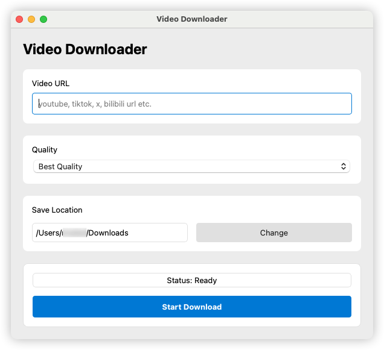

# Video Downloader

**Video Downloader** is a user-friendly desktop application built with Python and PyQt5 that allows you to easily download YouTube videos  or TikTok videos in the best available quality (video + audio). The app uses the `yt-dlp` library to handle the download process.

## Features

- Download YouTube videos or Tiktok videos in the best quality (video + audio).
- Choose the save directory for downloaded videos.
- Handle errors gracefully and display error messages.
- Simple and intuitive user interface built with PyQt5.

## Requirements

- Python 3.6 or higher
- `yt-dlp` library
- `PyQt5` library for the GUI

### Installing Dependencies

Before running the application, install the required libraries using pip:

```bash
pip install yt-dlp PyQt5
```

## How to Use

### Running the Application

To run the Video Downloader App, simply execute the Python script:

```bash
python video_downloader.py
```

This will open the application window where you can:

1. **Enter a Video URL**: Paste the video URL into the input field.
2. **Choose a Save Directory**: Click the "Choose Save Directory" button to select the directory where the video will be saved.
3. **Start Download**: Click the "Download" button to start downloading the video. The progress will be displayed in the progress bar.

### GUI Interface Overview

- **URL Input Field**: This is where you paste the YouTube video URL you want to download.
- **Save Directory Button**: Opens a file dialog to choose where the downloaded video will be saved.
- **Progress Bar**: A visual indicator showing the download progress.
- **Download Button**: Starts the download process once a valid URL is entered.
- **Status Label**: Displays messages such as download status or error messages.

### Example Screenshot



## Error Handling

The app will catch any errors during the download process and display an error message in a dialog box. Errors could include:

- Invalid YouTube URL
- Network issues
- Invalid save directory

### Common Errors

- **Error: Invalid URL**: Ensure the URL entered is a valid YouTube video URL.
- **Error: No save directory selected**: Ensure you choose a valid directory to save the downloaded video.

## License

This project is licensed under the MIT License. See the [LICENSE](LICENSE) file for details.